# Pertemuan 6 - Layout dan Navigasi

## Praktikum 1 : Membangun Layout di Flutter
Langkah 1 : Buat Project Baru

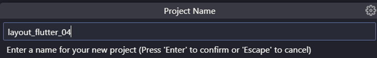

Langkah 2 : Buuka file libmain.dart

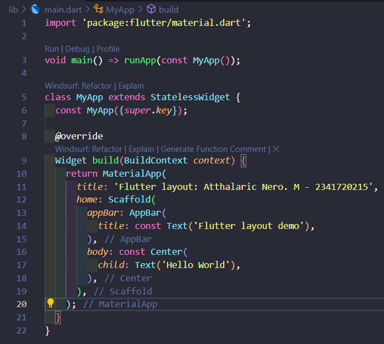

Langkah 3 : Identifikasi Layout diagram 

Column(
  children: [
    Image,
    titleSection (Row),
    buttonSection (Row),
    textSection (Text),
  ]
)

Langkah 4 : Implementasi Tittle Row
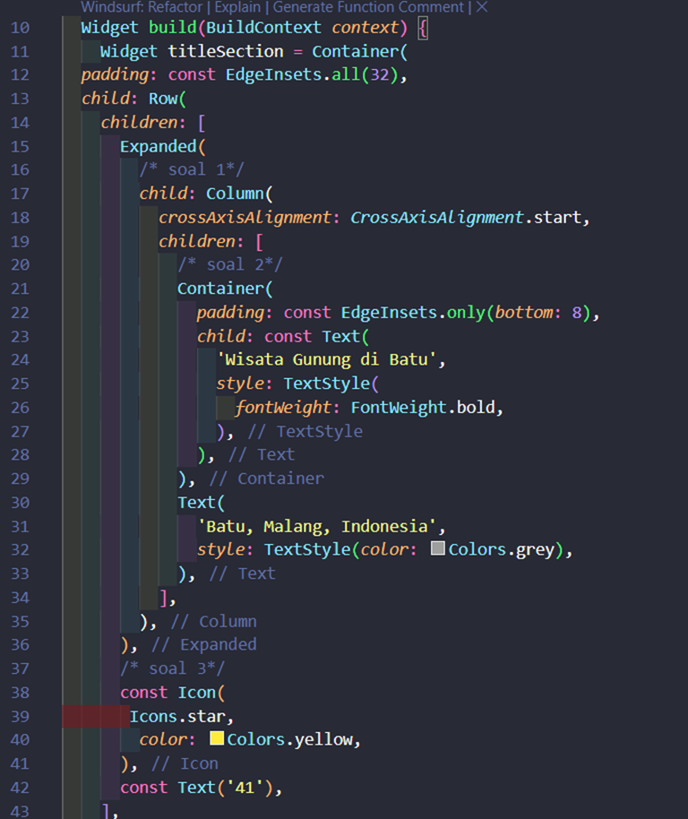

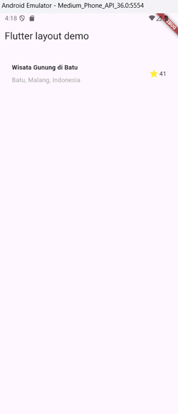

## Praktikum 2 : Implementasi Button Row

Langkah 1 : Buat method Column _buildButtonColumn

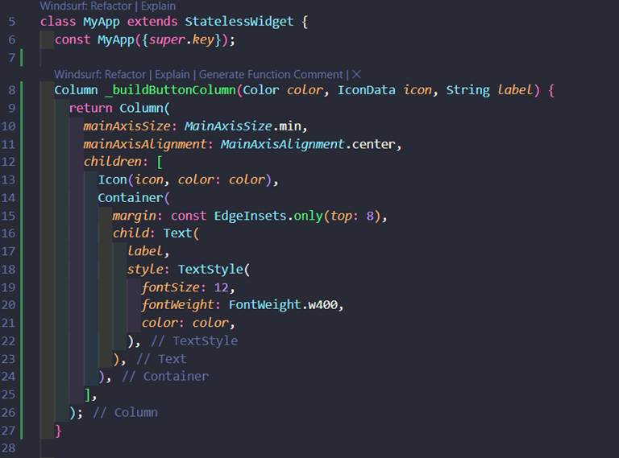

Langkah 2 : Buat widget ButtonSection
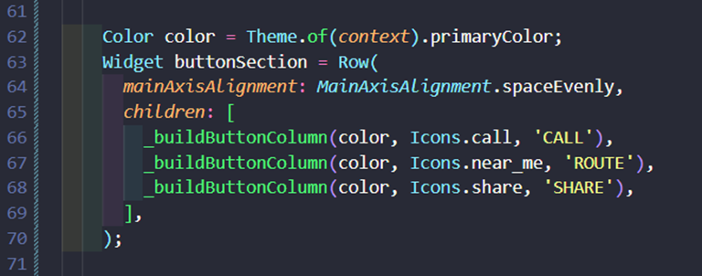

Langkah 3 : Tambah Button Section ke Body
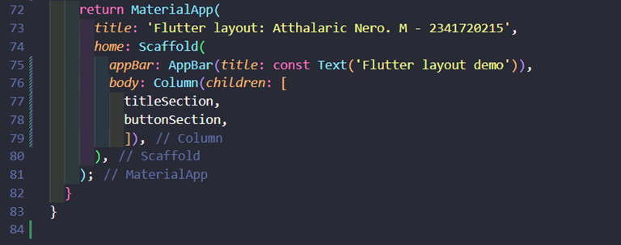

## Praktikum 3 : Implementasi Text Section

Langkah 1 : Buat widget textSection
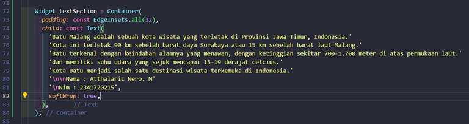

Langkah 2 : Tambahkan variabel text section ke body
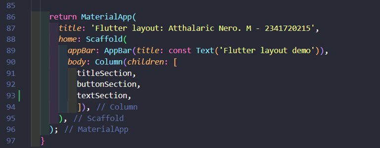

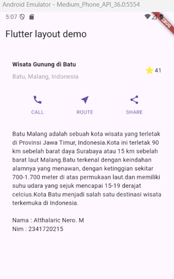

## Praktikum 4 : Implementasi Image Section

Langkah 1 : Siapkan aset gambar

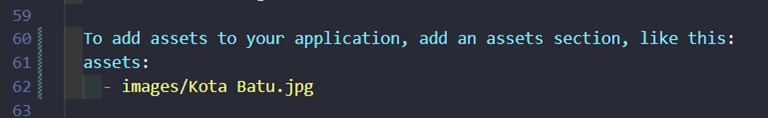

Langkah 2 : Tambahkan gambar ke body

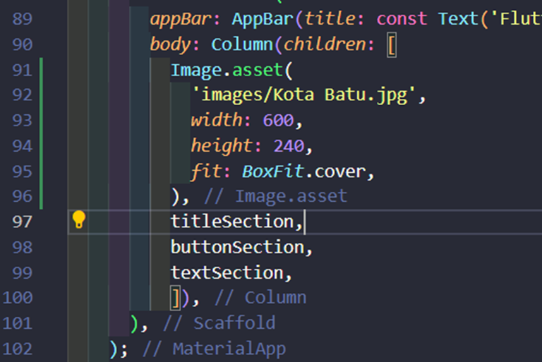

Langkah 3 : Terakhir ubah menjadi ListView

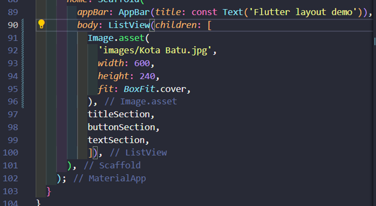

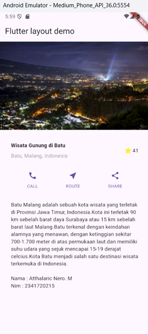

## Tugas Praktikum 1
Silakan implementasikan di project baru "basic_layout_flutter" dengan mengakses sumber ini: https:docs.flutter.devcodelabslayout-basics 

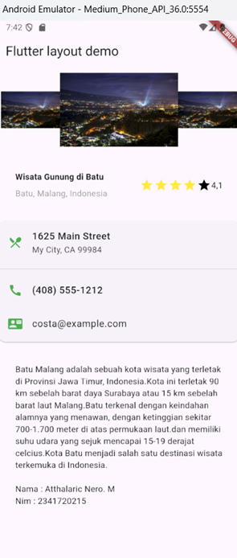