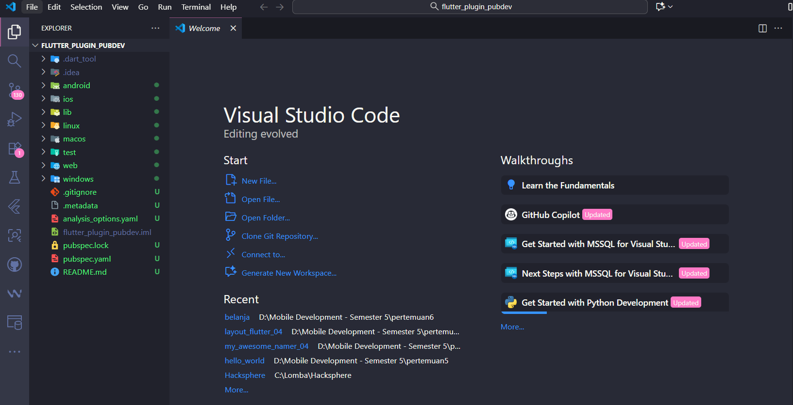
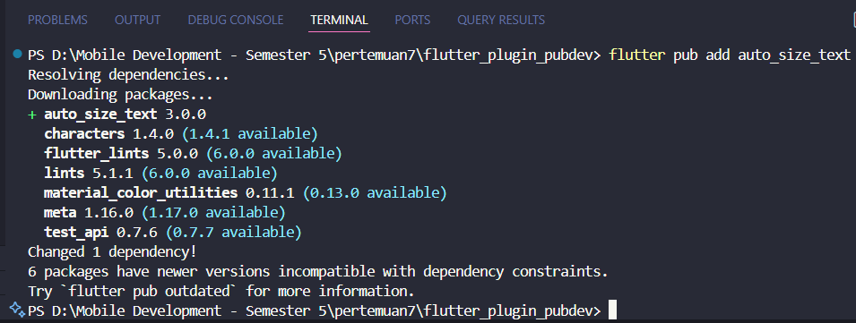
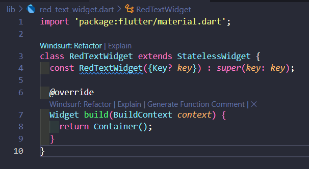
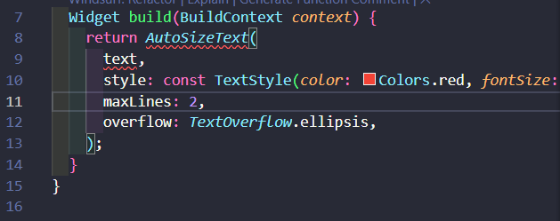
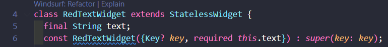
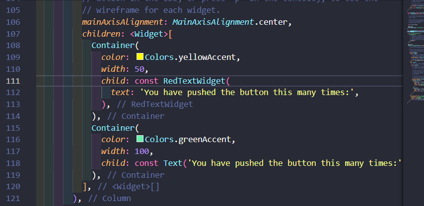
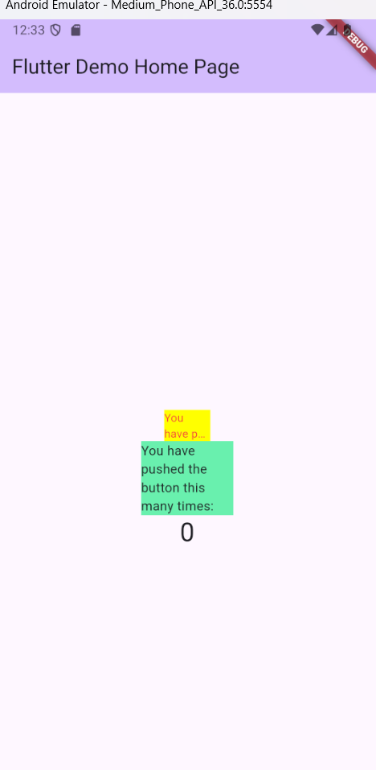

# Jobsheet 7

## Praktikum
Langkah 1: Buat Project Baru

Langkah 2: Menambahkan Plugin

Langkah 3: Buat file red_text_widget.dart

Langkah 4: Tambah Widget AutoSizeText

Langkah 5: Buat Variabel text dan parameter di constructor

Langkah 6: Tambahkan widget di main.dart

Run aplikasi tersebut dengan tekan F5, maka hasilnya akan seperti berikut.
